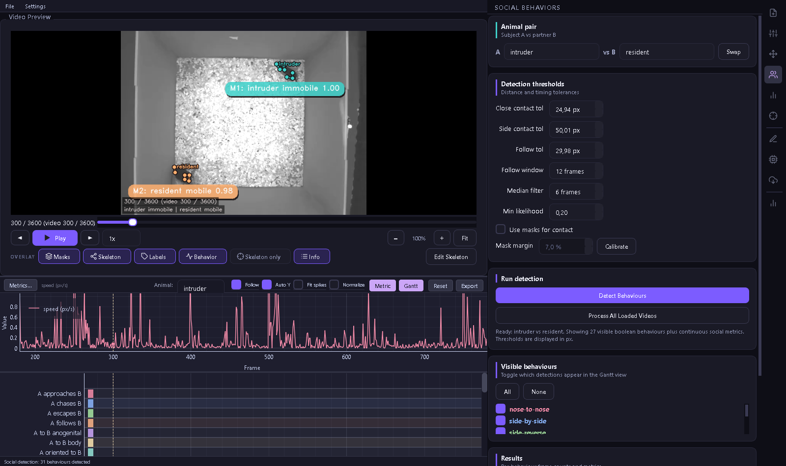
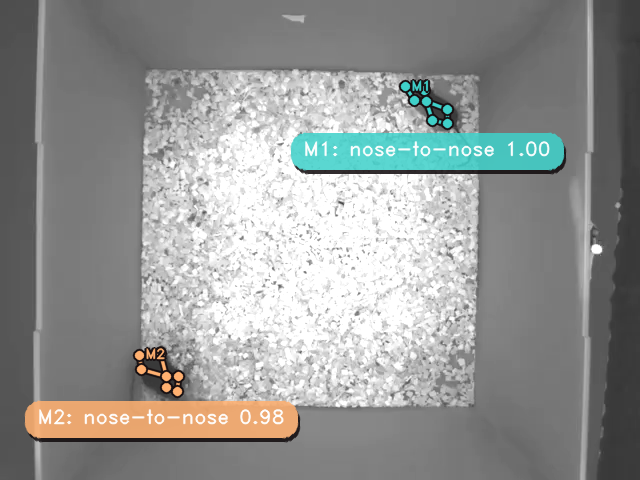
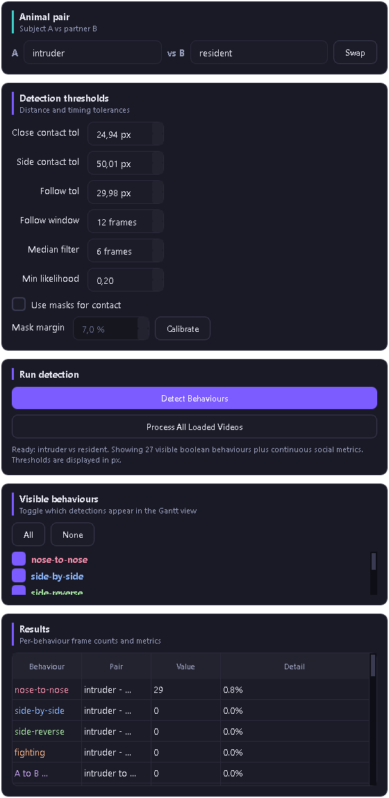

<div align="center">

# 🐭 DLC Post-Processing

### A desktop studio for everything that happens *after* DeepLabCut

Load your DLC tracking, scrub the video with the skeleton drawn on top, scrub out the jitter,
turn pixels into kinematics, catch your mice red-pawed doing social behaviours, and export
tidy GLM-ready tables. All offline, all local, all in one window.




*A real two-mouse recording in the studio: colored skeletons and live behaviour labels burned
onto the video, a speed trace, a multi-row behaviour gantt, and the social-behaviour panel with
its summary table, all in one window.*

</div>

---

## ✨ What it does

DeepLabCut gives you keypoints. This gives you everything after that, without a single line of
glue code:

- 📂 **Load** `.h5` / `.csv` DLC output side-by-side with the source video. Drag-and-drop, folder
  scan with automatic video ↔ tracking pairing, and project save/load (`.dlcproj`).
- 🧹 **Clean** noisy tracks: likelihood filtering, spline gap-filling, Savitzky-Golay smoothing,
  impossible-jump repair, and frame-range surgery right on the timeline.
- 🏃 **Kinematics**: speed, acceleration, jerk, distance travelled, body orientation, elongation,
  path tortuosity, trajectory curvature, mobility / rearing states, and more, in real units once
  you set a `px/cm` calibration.
- 🐭🐭 **Social behaviours** for dyads: nose-to-nose, side-by-side, nose-to-anogenital,
  following, chasing, withdrawal, orientation, approach speed, inter-animal distance, and a whole
  ethogram of vectorized detectors.
- 🎯 **Regions of interest**: draw polygons, get time-in-zone and entries per animal.
- 🪪 **Identity refinement**: swap, rename, and fix track identities (optionally guided by
  segmentation masks) over any frame range, then write the corrected CSV back out.
- 🎞️ **Behaviour overlay video** in broadcast style: per-animal coloured skeletons plus rounded
  behaviour badges (e.g. `M1: nose-to-nose 0.59`, `M2: nose-to-nose 0.59`) with confidence scores,
  burned into an `.mp4`. Masks, name tags, and ROIs optional; per-animal or bottom-banner badges.
- 📊 **Batch + metadata**: process a whole folder of recordings, attach experimental metadata,
  and export per-group summary figures with statistics (Holm-corrected t-tests and friends).
- 🧠 **GLM-ready export**: one wide framewise table per recording (`time_s`, every metric, every
  behaviour boolean) ready to drop into a regression or a classifier.
- 🤖 **Optional DLC inference**: point it at a config and run `analyze_videos` from inside the app,
  either in the current environment or via a dedicated conda env.

> Everything runs on your machine. No accounts, no uploads. Settings live in
> `~/.dlc_processor/settings.json`.

---

## 📸 More views

**Tracking overlay.** Each animal gets its own colored skeleton, with the active behaviours
printed right on the frame (here: `A to B body`, `B to A body`, `B oriented to A`, `mask contact`,
`passive investigation`, mobility states) and an optional segmentation-mask contact check.



**Social behaviour detection.** Pick the dyad, tune the contact and follow tolerances (in real
centimetres once calibrated), tick the behaviours you care about, hit **Detect**, and read the
per-behaviour summary table while the gantt fills in below.

<div align="center">

</div>

---

## 🚀 Quickstart

### Option A: conda (recommended)

```bash
git clone https://github.com/Andrianarivelo/DLC_post_processing.git
cd DLC_post_processing
conda env create -f environment.yaml
conda activate dlc-postproc
python app.py
```

### Option B: pip + venv

```bash
git clone https://github.com/Andrianarivelo/DLC_post_processing.git
cd DLC_post_processing

python -m venv .venv
# Windows
.venv\Scripts\activate
# macOS / Linux
source .venv/bin/activate

pip install -r requirements.txt
python app.py
```

That is it. The window in the screenshot opens straight away.

---

## 🎬 Try the demo (real data, ships in the repo)

The `example_data/` folder contains a real 120-second slice of a resident-intruder assay:
two mice (`resident`, `intruder`), seven bodyparts each (`nose`, `left_ear`, `right_ear`,
`neck`, `left_hip`, `right_hip`, `tail`).

```
example_data/
├── demo_two_mice.mp4              # 120 s, 30 fps, downscaled for git
└── demo_two_miceDLC_dlcrnet.csv  # matching DeepLabCut tracking
```

To reproduce the screenshot in three clicks:

1. Launch with `python app.py`.
2. **Load** panel → drag both files in (or *Open Folder…* and point at `example_data/`). The video
   and tracking pair up automatically and the first frame renders with the skeleton.
3. Hit **Kinematics → Compute**, then **Social → Detect**. Scrub to around the 110-second mark to
   catch the nose-to-nose contact.

Export a GLM-ready table from the **Export** panel and you will get a wide CSV with one row per
frame and a column for every metric and every behaviour.

---

## 🧭 The workflow, panel by panel

The activity bar on the right drives everything. A typical session flows top to bottom:

| Panel | You do | You get |
| --- | --- | --- |
| **Load** | Add video + DLC files | Paired recordings, first frame with overlay |
| **Clean** | Filter / interpolate / smooth | Denoised tracks, written back as `_cleaned` CSV |
| **Kinematics** | Set fps + calibration, compute | Per-frame speed, accel, orientation, states |
| **Social** | Choose a dyad, pick behaviours | Boolean ethogram + summary table + gantt |
| **ROI** | Draw zones | Time-in-zone and entry counts |
| **Batch / Metadata** | Attach metadata, run folder | Group summaries + statistics figures |
| **Refine** | Swap / rename / fix IDs | Corrected identities, re-exported CSV |
| **Infer** | Point at a DLC config | Fresh `.h5` tracking, loaded back in |
| **Export** | Choose outputs | Behaviour overlay video (badges + skeletons) and/or GLM-ready tables |

---

## 🗂️ Project layout

```
DLC_post_processing/
├── app.py                 # standalone launcher (QMainWindow + dark theme)
├── dlc_processor/         # the package
│   ├── core/              # loaders, cleaning, kinematics, social, batch, ROI, export
│   ├── ui/                # one Qt panel per step of the workflow
│   ├── workers/           # threaded overlay rendering, inference, video export
│   └── tests/             # 97 tests covering loading, cleaning, social, batch, overlay
├── shared/                # reusable sidebar layout + SVG icon set + premium UI kit
├── example_data/          # the real demo clip + tracking
├── docs/                  # screenshots
├── requirements.txt       # pip dependencies
└── environment.yaml       # conda environment
```

---

## 🔌 Optional bits

- **HDF5 (`.h5`) tracking and tables**: install `tables` and `h5py` (already in
  `environment.yaml`). CSV works without them.
- **DeepLabCut inference**: keep DLC in its own heavy environment. The **Infer** panel can call
  that environment over a subprocess, so this studio stays light. Plain post-processing of the
  `.h5` / `.csv` DLC already produced needs nothing extra.

---

## 🧪 Running the tests

```bash
pip install pytest
QT_QPA_PLATFORM=offscreen pytest dlc_processor/tests -q   # macOS / Linux
# Windows PowerShell:
$env:QT_QPA_PLATFORM="offscreen"; pytest dlc_processor/tests -q
```

---

## 📜 License

[MIT](LICENSE) © 2026 Andrianarivelo. Go forth and quantify behaviour.
